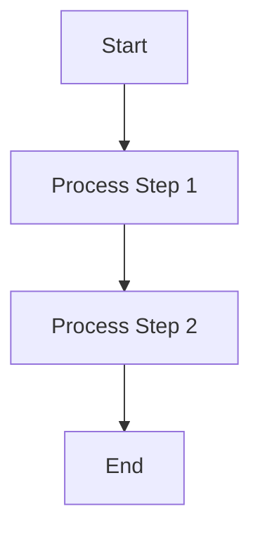
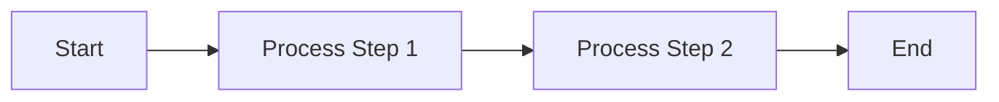

# Hardware Architecture Dashboard Generation Skill (Native EDA Style)

本文档总结了将传统硬件详细设计文档（Markdown/Word）转化为**“现代化、交互式、极客风 Web Dashboard”**的核心技能（Skill）与最佳实践。在未来的硬件设计文档开发中，应严格遵循本套体系进行构建。

## 1. 核心设计理念 (Core Philosophy)
*   **摒弃静态文档**：不再使用干瘪的 Markdown 或 PDF，而是构建拥有左侧全局导航（Sidebar）和右侧内容区（Content Pane）的单页面 Web 应用（SPA）。
*   **极致的极客美学**：采用类似顶级开发者文档（如 Stripe, Tailwind）的视觉规范。深色顶栏、玻璃拟态（Glassmorphism）吸顶导航、高对比度语法高亮。
*   **原生 EDA 级图表**：不依赖外部低清图片，全量使用原生 SVG、HTML/CSS 渲染的 Gantt 图以及调优后的 Mermaid 图表，确保在 4K 屏幕下依然无限放大不失真。
*   **极致图文并茂 (Visual-First Strategy)**：技术原理的解释绝不能是干瘪的纯文本。**强制约束：每一段核心逻辑或算法思想的文字说明，都必须配有一张精心设计的可视化图表（Diagram），并附带对应的中文算法步骤流程（Algorithm Steps）**，做到“文字释义 + 架构图表 + 中文算法步骤”三位一体，让读者能够瞬间建立直观且深刻的理解。不建议使用纯代码语法的伪代码，应使用自然语言与流程图结合的方式表达清楚。

## 2. UI 框架与排版规范 (UI & Layout Guidelines)
*   **字体栈 (Typography)**：正文优先使用系统级无衬线字体（如 `-apple-system, BlinkMacSystemFont, "Segoe UI", Roboto`），代码和图表标识严格使用等宽字体（`'Roboto Mono', monospace` 或 `Consolas`）。
*   **色彩系统 (Color Palette)**：
    *   主色调采用深邃的科技蓝/极客黑（如 `#0f172a`, `#1e293b`）。
    *   文字使用板岩灰（`#334155` 用于标题，`#475569` 用于正文）。
    *   突出警示信息采用高饱和度色彩（如红色警示框 `#fef2f2` 背景 + `#ef4444` 左边框）。
*   **交互细节**：表格增加 Hover 斑马线效果，侧边栏导航点击高亮并支持平滑滚动（`scroll-behavior: smooth`）。

## 3. 高级硬件图表可视化 (Advanced Hardware Visualizations)

这是本套 Skill 的核心灵魂，必须摒弃传统的粗糙表达方式：

### 3.1 物理流水线拓扑图 (Custom SVG Datapath)
*   **布局策略**：对于芯片内部的物理数据流，采用原生 SVG 绘制 **“Z字型” (S-shape)** 或折返式流水线拓扑，模拟真实的物理走线，极大地节省横向空间。
*   **尺寸与防压缩策略 (Critical)**：
    *   画布宽度必须足够大（如 `1400px`），模块文字字号至少 **20px**，连线位宽标识至少 **14px**。
    *   **致命陷阱规避**：浏览器会自动压缩超大 SVG。必须在 CSS 中为 SVG 注入强硬规则：`min-width: 1400px !important; max-width: none !important; height: auto !important;`。
    *   外层包裹 `div` 必须设置 `overflow-x: auto`，并且对齐方式**必须使用 `justify-content: flex-start;`**，绝对不能用 `center`，否则超出的左侧内容会被永久裁切！

### 3.2 周期级时序图 (Native HTML/CSS Gantt)
*   **痛点**：传统 Markdown 表格无法直观表达硬件的 Clock Cycle 时序。
*   **解决方案**：使用 `div` 栅格拼接出来的原生甘特图（Gantt Chart）。
*   **结构**：左侧固定表头（信号名/模块名），右侧为横向可滚动的周期网格。通过精准计算 `width` 和 `left` 偏移量来绘制彩色 Block，完美表达硬件加法器复用、流水线 Bubble、握手等待等精细时序。

### 3.3 模块层级与状态机 (Mermaid.js)
*   使用 Mermaid 绘制模块架构树，但默认样式极度紧凑。
*   **强制调优**：
    *   在图表开头必须注入配置项：`%%{init: {'theme': 'base', 'flowchart': {'nodeSpacing': 80, 'rankSpacing': 150, 'curve': 'bumpX'}}}%%`。拉大间距并使用平滑贝塞尔曲线。
    *   同样应用 SVG 防压缩规则，设置 `min-width: 1200px !important` 和外层容器的 `justify-content: flex-start`，确保图表庞大且舒展。

### 3.4 Mermaid 陷阱规避与排版进阶策略 (Mermaid Traps & Advanced Layouts)
在通过 Mermaid 绘制复杂硬件流水线时，极易踩中词法解析器崩溃或布局失控的雷区，必须严格遵守以下排版与语法纪律：
*   **致命陷阱：Syntax error in text (特殊字符引发的渲染崩溃)**：
    *   **痛点**：当节点文本或子图 (subgraph) 标题中出现空格、括号 `()`、冒号 `:`、斜杠 `/`、破折号 `-` 或 HTML 换行符 `<br>` 时，会导致 Mermaid (尤其是 10.x 版本) 解析引擎直接崩溃，弹出炸弹图标。
    *   **强制规避**：**必须**为所有带文字的节点和子图标题加上**双引号 `""`** 进行包裹转义。例如：错误写法 `A[文本(包含特殊)]` / `subgraph S1 [带 空格 标题]`，**正确写法** `A["文本(包含特殊)"]` / `subgraph S1 ["带 空格 标题"]`。
*   **排版进阶 1：消除多子图垂直留白与文字遮挡 (Row-by-Row 水平流)**：
    *   **痛点2：排版重叠与穿模遮挡 (Element Occlusion)**：当为了缩小图表物理宽度而极端压缩 `nodeSpacing` 和 `rankSpacing`（如设置到 20 左右）时，如果此时配合了巨大的 `fontSize`（如 28px/32px），Mermaid 的排版引擎会因为安全裕度不足，导致连线直接穿透文本、子图标题被跨图连线腰斩、节点框相互挤压重叠。此外，在 `subgraph` 内部去声明一条连接到外部节点的线，也会引发严重的连线穿模。
    *   **破局约束 (Anti-Occlusion Rules)**：
        1. **安全间距底线**：当使用 28px 以上的超大字号时，`nodeSpacing` 和 `rankSpacing` **绝对不得低于 40**（推荐 40~60 之间），必须给引擎留足走线空间。
        2. **跨图连线全局声明**：**跨越不同 `subgraph` 之间的节点连线（例如 `A --> B`），必须写在所有 `subgraph` 结构体定义的外部（即全局最外层）**。严禁在一个 `subgraph` 内部写出指向另一个 `subgraph` 内部节点的连线逻辑，这是彻底消灭“连线腰斩标题”等穿模现象的黄金法则。
    *   **解决方案 (外竖内横隔离法 + 规范化连线)**：
        1. 外层使用 `flowchart TB`，每个 `subgraph` 内部使用 `direction LR`。
        2. **最核心一步**：绝不能让连线跨越子图内部的节点！应将跨图的依赖线连在外部大框上（例如 `Row1 -.-> Row2`），彻底切断跨图干涉，完美实现上下双行、内部横向展开。
        3. **防止遮挡**：跨大框的带字连线，**强制要求使用点阵文字语法** `Row1 -. "说明文字" .-> Row2`，绝对禁止使用 `|文字|` 语法，这样能最大程度促使布局引擎分配合理的水平留白，避免元素遮挡。
*   **排版进阶 2：并排对比面板 (Side-by-Side Columns)**：
    *   **需求**：需要将两种流水线架构（如全串行 vs MD并发）作为两个垂直的长面板，**左右并排**放置以缩小垂直纵深。
    *   **解决方案 (外横内竖法)**：外层使用 `flowchart LR` 将两大赛道左右并排铺开，而在每个 `subgraph` 内部强制使用 `direction TD` 让具体步骤从上往下流转。由此得到两个优雅的并肩长列。

## 4. 硬件代码与高亮 (RTL Code & Syntax Highlighting)
*   **引擎**：集成 `highlight.js`，并必须显式加载 `verilog.min.js` 语言包。
*   **生命周期**：确保 HTML 中的 JS 加载顺序：`核心包 -> verilog语言包 -> hljs.highlightAll()`。HTML 标签必须使用 `<code class="language-verilog">`（注意不是 systemverilog，引擎只认 verilog）。
*   **主题覆写 (Theme Override)**：
    *   采用 `Atom One Dark` 等深色极客主题。
    *   **注释高亮补丁**：默认的暗灰色注释在深色背景下可视性极差。必须在全局 CSS 注入补丁：`.hljs-comment { color: #86efac !important; font-style: italic; }`，将注释改为亮浅绿色斜体，大幅提升阅读体验。

## 5. 自动化构建工具流 (Python Parser Workflow)
*   文档由 Python 脚本自动将散落的资料组合、解析并生成最终的 HTML。
*   **正则表达式与锚点**：脚本需具备自动扫描全文标题、生成侧边栏锚点并注入 HTML 对应 `id` 的能力。
*   **特殊块拦截**：脚本应当能够识别特定的标记（如 `[GANTT_START]`、`[SVG_DATAPATH_START]`），并在这些位置注入高阶可视化组件的代码。

## 6. 侧边栏目录与弹性布局 (Sidebar TOC & Flexbox Layout)
*   **布局重构**：抛弃传统的单栏居中流式布局。在全局 `body` 使用 `display: flex; height: 100vh; overflow: hidden;`，将页面切分为左侧固定的 `.sidebar` 和右侧滚动的 `.main-content`，以匹配专业级 Dashboard 体验。
*   **目录自动生成 (Vanilla JS)**：
    *   绝不手动编写锚点目录。必须在 HTML 底部注入 Vanilla JS 脚本。
    *   脚本逻辑：使用 `document.querySelectorAll('h2, h3')` 提取大纲，为每个 DOM 节点赋予唯一 `id`，然后在 `.sidebar` 中动态生成包裹 `<a>` 标签的 `<li>` 列表。
*   **交互联动**：
    *   **平滑跳转**：为 TOC 链接绑定 `click` 事件并调用 `scrollTo({ behavior: 'smooth' })`。
    *   **滚动监听 (Scroll Tracking)**：监听右侧主内容的 `scroll` 事件，动态计算当前到达的标题位置，实时高亮左侧 TOC 中的对应链接 (`.active` 样式)。

## 7. 核心突破机制的视觉强调 (Critical Mechanism Highlighting)
*   **痛点与突破口分离**：对于架构中最核心的“作弊/解耦”机制（例如：为了流水线解耦，强行使用**原始像素**替代**重建像素**来进行模式粗选），这种颠覆常规理论的突破点，必须与普通的说明文字拉开视觉差距。
*   **强制使用预警/强提醒样式 (`.critical-alert`)**：
    *   绝不可使用普通的 `<div class="highlight">`（那只是用于补充说明或知识普及）。
    *   必须使用带醒目边框、刺眼底色和特殊字体的 `.critical-alert` 样式（如红色左边框、淡红底色）。
    *   内部的核心关键字词，还要进一步嵌套 `<span style="background: #fecaca; padding: 2px 6px; border-radius: 4px; color: #991b1b; font-weight: 700;">` 这种极其抢眼的底色高亮。
    *   **目的**：让硬件架构师或算法人员在快速扫视文档时，第一眼就能被这个极其重要的架构魔法设计“刺瞎”，确保知识传达零遗漏。

## 8. 防呆与一致性约束 (DOM & Navigation Consistency)
*   **物理 DOM 顺序强约束**：在进行文档层级重构或章节移动时，**绝对禁止**只修改标题序号（如把 3.1 改为 1.2）而不迁移底层 HTML 代码块的“掩耳盗铃”式操作。所有正文段落、图表 div 必须在 HTML 文件中与它们的父级 `<h>` 标签保持严格的**物理从上到下**顺序，且务必检查 `</div>` 标签的完美闭合，防止整段文章被错误吞噬。
*   **双导航同源提取策略 (Dual-Navigation Sync)**：
    *   **严禁硬编码**：绝对禁止手动写死顶部的胶囊导航或左侧的目录索引。
    *   **同源渲染**：必须使用统一的 Vanilla JS 脚本，在页面加载时一次性扫描全文的 `<h2>` 和 `<h3>` 标签。
    *   **职责分化**：左侧 TOC 渲染为树状细分目录（包含 `<h2>` 和 `<h3>`）；顶部胶囊导航作为页面核心脉络视图，仅渲染 `<h2>` 的标题内容。
    *   **状态同步**：滚动监听器 (`scroll`) 必须同时更新这两套导航的 `.active` 状态，确保用户的横向视觉（顶部）和纵向视觉（左侧）永远保持完美一致。

---
**使用说明**：未来让 AI 协助撰写新的芯片模块详细设计说明书时，可直接将此文档内容喂给 AI，并下达指令：“*请按照《Hardware Architecture Dashboard Generation Skill》的标准，为我解析并生成新模块的设计文档。*”


# 交互式标准 HTML 文档模板规范 (Interactive HTML Dashboard Standard Skill)

本文档定义了目前标准化的单页面交互式 HTML 硬件/架构设计文档规范。它结合了极简侧边栏、顶部胶囊导航、以及深度定制的 Mermaid 原生图表等特性，作为后续生成设计文档的**基准 HTML 框架**。

## 1. 核心架构与布局体系 (Core Layout Architecture)
标准文档抛弃了流式中心化布局，采用 **“固定侧边栏 (Sidebar) + 独立滚动主内容区 (Main Content) + 内容卡片 (Container)”** 的经典 Dashboard 布局。
*   **侧边栏 (Sidebar)**：宽度固定 (300px)，带有轻微的右侧阴影，专门用于展示全量分级目录 (H2 & H3)。
*   **主内容区与卡片 (Main Content & Container)**：主区负责滚动 (`overflow-y: auto`)，内部放置一个最大宽度 `1000px` 的卡片式 `div.container` 以集中视线，避免宽屏下文字过长影响阅读。
*   **顶部导航 (Top Nav)**：在卡片顶部提供横向的胶囊状快速导航（仅提取核心的 H2 章节），用于快速在宏观模块间跳跃。

## 2. 色彩系统与视觉规范 (Color System & Visuals)
使用 CSS 原生变量定义全局主题色，确保高度统一与极客观感：
```css
:root {
    --primary: #4a148c;   /* 核心主色调（深紫/深蓝均可，此处以深紫为例） */
    --secondary: #7b1fa2; /* 次级色调 */
    --accent: #ff6f00;    /* 强调色（橙色等） */
    --bg: #f3e5f5;        /* 页面底色/部分高亮底色 */
    --card-bg: #ffffff;   /* 内容卡片纯白底色 */
}
```

## 3. 定制化警告与信息块 (Custom Callout Blocks)
技术文档中必须通过醒目的区块来区分普通描述与“核心痛点/架构突破点”。要求使用特定的 CSS 类：
*   **`.highlight` (核心知识/痛点提示)**：浅色背景（如 `#e3f2fd`），配合左侧加粗边框，用于解释某个协议或算法的基础知识。
*   **`.success` (我们的解决方案/突破口)**：淡绿色背景（如 `#e8f5e9`），配合深绿边框，用于强势展示 C-Model 或硬件是如何解决上述痛点的。

## 4. Mermaid 图表与图注 (Mermaid & Captions)
*   **ESM 模块化加载**：统一采用现代化的 ES6 模块导入 Mermaid 库：
    ```html
    <script type="module">
      import mermaid from 'https://cdn.jsdelivr.net/npm/mermaid@10/dist/mermaid.esm.min.mjs';
      mermaid.initialize({ startOnLoad: true, theme: 'default' });
    </script>
    ```
*   **居中排版与图注**：包裹在 `.mermaid` 容器内并居中显示，下方**必须**紧跟一段 `.diagram-caption` 的文字说明，交代该图表的核心意图。

## 5. 自动目录与双导航联动 (Auto TOC & Dual Navigation)
这是标准模板的核心逻辑灵魂，**绝不手动编写目录或链接**，全依赖 Vanilla JS 自动扫描与状态同步：
1.  **扫描目标**：`document.querySelectorAll('.container h2:not(.toc-title), .container h3')`。
2.  **Sidebar 生成**：将所有 H2 设为 `level-2`，H3 设为 `level-3`（带缩进），插入左侧列表。
3.  **Top Nav 生成**：仅提取 H2 的内容，渲染为带有 `.top-nav-link` 样式的横向胶囊按钮。
4.  **联动监听 (Scroll Tracking)**：监听 `main-content` 的滚动事件，计算当前处于哪个标题管辖范围内，并**同时更新**左侧 Sidebar 和顶部 Top Nav 对应项的 `.active` 高亮状态。

---

## 附录：标准的 HTML Boilerplate 代码

以下是符合该标准的极致纯净版 HTML 框架骨架。在新建任何硬件架构总结时，请直接 Copy 此代码并在 `<div class="container">` 内部补充内容：

```html
<!DOCTYPE html>
<html lang="zh-CN">
<head>
    <meta charset="UTF-8">
    <meta name="viewport" content="width=device-width, initial-scale=1.0">
    <title>硬件架构设计文档标准模板</title>
    <script type="module">
      import mermaid from 'https://cdn.jsdelivr.net/npm/mermaid@10/dist/mermaid.esm.min.mjs';
      mermaid.initialize({ startOnLoad: true, theme: 'default' });
    </script>
    <style>
        :root {
            --primary: #0288d1;
            --secondary: #0277bd;
            --accent: #ff6f00;
            --bg: #f8fafc;
            --card-bg: #ffffff;
        }
        body { font-family: -apple-system, BlinkMacSystemFont, "Segoe UI", Roboto, Helvetica, Arial, sans-serif; line-height: 1.6; color: #333; margin: 0; padding: 0; display: flex; height: 100vh; overflow: hidden; background: var(--bg); }
        .sidebar { width: 300px; background: white; border-right: 1px solid #e2e8f0; overflow-y: auto; padding: 30px; flex-shrink: 0; box-shadow: 2px 0 10px rgba(0,0,0,0.02); }
        .sidebar h2.toc-title { font-size: 14px; color: #94a3b8; text-transform: uppercase; margin-bottom: 20px; letter-spacing: 1px; margin-top: 0; }
        .sidebar ul { list-style: none; padding: 0; margin: 0; }
        .sidebar li { margin-bottom: 8px; }
        .sidebar a { color: #475569; text-decoration: none; display: block; padding: 8px 12px; border-radius: 6px; font-size: 14px; transition: all 0.2s; }
        .sidebar a:hover { background: #f1f5f9; color: var(--primary); }
        .sidebar a.active { background: #eff6ff; color: var(--primary); font-weight: 600; border-left: 3px solid var(--primary); }
        .sidebar li.level-2 a { padding-left: 12px; }
        .sidebar li.level-3 a { padding-left: 30px; font-size: 13px; color: #64748b; }
        
        .main-content { flex-grow: 1; overflow-y: auto; padding: 40px; scroll-behavior: smooth; }
        .container { max-width: 1000px; margin: 0 auto; background: var(--card-bg); padding: 40px 60px; border-radius: 12px; box-shadow: 0 10px 30px rgba(0,0,0,0.08); }

        h1 { color: var(--primary); text-align: center; border-bottom: 3px solid var(--secondary); padding-bottom: 15px; margin-bottom: 40px; }
        h2 { color: var(--secondary); margin-top: 40px; border-left: 5px solid var(--secondary); padding-left: 15px; }
        h3 { color: #555; }
        
        .highlight { background-color: #e3f2fd; border-left: 4px solid var(--secondary); padding: 15px; margin: 20px 0; border-radius: 0 4px 4px 0; }
        .success { background-color: #e8f5e9; border-left: 4px solid #2e7d32; padding: 15px; margin: 20px 0; border-radius: 0 4px 4px 0; }
        
        .mermaid { display: flex; justify-content: center; margin: 30px 0; background: #fafafa; padding: 20px; border: 1px solid #eee; border-radius: 8px; }
        .diagram-caption { text-align: center; color: #7f8c8d; font-size: 0.9em; margin-top: -15px; margin-bottom: 30px; font-style: italic; }
        
        .top-nav { display: flex; flex-wrap: wrap; gap: 10px; margin-bottom: 25px; padding-bottom: 15px; border-bottom: 1px solid #e0e0e0; }
        .top-nav-link { background: #f8fafc; color: var(--primary); padding: 8px 16px; border-radius: 20px; font-size: 13px; font-weight: 600; text-decoration: none; border: 1px solid #e2e8f0; transition: all 0.2s; }
        .top-nav-link:hover { background: #e0f2fe; }
        .top-nav-link.active { background: var(--primary); color: white; border-color: var(--primary); }
    </style>
</head>
<body>

<div class="sidebar">
    <h2 class="toc-title">目录导航</h2>
    <ul id="toc-list"></ul>
</div>
<div class="main-content" id="main-content">
<div class="container">
    <div class="top-nav" id="top-nav"></div>
    <h1>模块与架构机制总结<br><span style="font-size:0.6em; color:#7f8c8d;">Architecture & Bottlenecks</span></h1>

    <!-- TODO: Write Content Here -->
    <h2>1. 核心架构痛点解析</h2>
    <p>在此处填入硬件瓶颈或者算法介绍内容...</p>
    
    <div class="highlight">
        <strong>💡 概念提示：</strong><br>
        这是需要引起读者注意的基础概念知识点。
    </div>

    <div class="success">
        <strong>我们的解决方案：</strong><br>
        这是我们应对上述痛点的独创解决思路。
    </div>

</div>
</div>

<script>
    document.addEventListener('DOMContentLoaded', () => {
        const tocList = document.getElementById('toc-list');
        const topNav = document.getElementById('top-nav');
        const headers = document.querySelectorAll('.container h2:not(.toc-title), .container h3');
        const mainContent = document.getElementById('main-content');
        
        headers.forEach((header, index) => {
            const id = 'section-' + index;
            header.id = id;
            
            const li = document.createElement('li');
            li.className = header.tagName === 'H2' ? 'level-2' : 'level-3';
            const a = document.createElement('a');
            a.href = '#' + id;
            a.textContent = header.textContent;
            
            a.addEventListener('click', (e) => {
                e.preventDefault();
                document.getElementById(id).scrollIntoView({ behavior: 'smooth' });
                // Fallback for container scroll alignment
                mainContent.scrollTo({ top: document.getElementById(id).offsetTop - 40, behavior: 'smooth' });
            });
            
            li.appendChild(a);
            tocList.appendChild(li);

            if (header.tagName === 'H2' && topNav) {
                const topA = document.createElement('a');
                topA.href = '#' + id;
                topA.className = 'top-nav-link';
                topA.textContent = header.textContent;
                topA.addEventListener('click', (e) => {
                    e.preventDefault();
                    mainContent.scrollTo({ top: document.getElementById(id).offsetTop - 40, behavior: 'smooth' });
                });
                topNav.appendChild(topA);
            }
        });
        
        mainContent.addEventListener('scroll', () => {
            let currentId = '';
            let currentH2Id = '';
            headers.forEach(header => {
                if (mainContent.scrollTop >= header.offsetTop - 100) {
                    currentId = header.id;
                    if (header.tagName === 'H2') currentH2Id = header.id;
                }
            });
            
            if (currentId) {
                document.querySelectorAll('.sidebar a').forEach(link => {
                    link.classList.remove('active');
                    if (link.getAttribute('href') === '#' + currentId) link.classList.add('active');
                });
            }
            if (currentH2Id) {
                document.querySelectorAll('.top-nav-link').forEach(link => {
                    link.classList.remove('active');
                    if (link.getAttribute('href') === '#' + currentH2Id) link.classList.add('active');
                });
            } else if (currentId) {
                let foundH2 = '';
                for (let i = 0; i < headers.length; i++) {
                    if (headers[i].id === currentId) {
                        for (let j = i; j >= 0; j--) {
                            if (headers[j].tagName === 'H2') { foundH2 = headers[j].id; break; }
                        }
                        break;
                    }
                }
                if (foundH2) {
                    document.querySelectorAll('.top-nav-link').forEach(link => {
                        link.classList.remove('active');
                        if (link.getAttribute('href') === '#' + foundH2) link.classList.add('active');
                    });
                }
            }
        });
        
        if(tocList.firstChild) tocList.firstChild.querySelector('a').classList.add('active');
        if(topNav && topNav.firstChild) topNav.firstChild.classList.add('active');
    });
</script>
</body>
</html>
```


# 硬件架构图表自适应排版技能指南 (Hardware Diagram Responsive Design Skill)

在编写现代化的硬件架构详细设计文档（尤其是基于 Web/HTML 的在线文档）时，硬件模块的流水线图、层级架构图以及巨型矩阵往往非常庞大。为了达到**“尽可能放大图表以保证极佳的可读性，同时绝对不产生横向滚动条（无需拖动）”**的最佳用户体验，总结出以下黄金排版定律与画图技能：

## 1. 原生 SVG 图表：绝对的相对宽度 (The 100% Rule)

**问题场景**：硬件时序图、数据流图或流水线图（如 Z 字形 MTT Flow）通常包含大量细密的文字和逻辑块。如果在 SVG 内部写死 `min-width` 或者在外部容器限制宽度，在小屏幕上就会出现滚动条，在大屏幕上又可能显得太小。

**Skill 解决方案**：
* **彻底解除宽度死锁**：在 SVG 根节点上，**永远不要**写死 `width="1400px"` 或 `min-width: 1400px`。
* **使用 ViewBox + 100% 宽度**：
  ```xml
  <!-- 正确的自适应 SVG 头部 -->
  <svg width="100%" height="auto" viewBox="0 0 1100 460" xmlns="...">
  ```
  通过定义画布的物理长宽比 (`viewBox`)，并将其渲染宽度设置为 `100%`。无论容器被压缩到多小，SVG 都会完美按比例缩放，永远不会越界产生滚动条。

## 2. Mermaid 层级架构图：方向与拉伸控制 (Orientation & Auto-Stretch)

**问题场景**：当使用 Mermaid 绘制含有大量叶子节点（如 8 个并行模块）的架构树时，由于叶子节点横向排列，导致图表物理宽度极宽。

**Skill 解决方案**：
* **善用横向延展 (graph LR)**：
  千万不要对宽树使用 `graph TD`（自上而下）。将图表方向改为 `graph LR`（自左向右）。这样树的深度决定了它的横向宽度，而架构图的深度通常较浅（如 3 层），从而使得图表本身变得极其紧凑。
* **CSS 强行拉伸满屏**：
  Mermaid 默认渲染出的 SVG 在满足其内置计算后就不会继续放大。为了让它“尽可能大”，必须在全局 CSS 中注入强制拉伸指令：
  ```css
  /* 强制所有 Mermaid 图表撑满可用宽度的 100% */
  .mermaid svg { width: 100% !important; height: auto !important; max-width: none !important; }
  ```
  由于它是横向排版（极度收敛），结合这行拉伸代码，图表就会如同气球一样完美膨胀到刚好铺满屏幕，里面的文字会被等比例放大，变得无比清晰硕大，且恰好不产生滚动条！

## 3. 巨型矩阵表格：动态降维打击 (Dynamic Scaling for Matrices)

**问题场景**：硬件算法（如 VVC）中常有 $32 \times 32$ 乃至 $64 \times 64$ 的巨大参数矩阵（如 DCT 系数矩阵）。如果按常规表格渲染，32 列数据必定会撑爆任何标准网页，出现冗长的横向滚动条。

**Skill 解决方案**：
对于需要完整呈现、不能折叠的超大表格，采用**基于规模的动态尺寸计算**，核心策略是“牺牲边缘留白，死保全局可视”。
* **动态 CSS 配置（以 Python 生成器为例）**：
  ```python
  if N >= 32:
      padding = "2px 2px"  # 极限压缩单元格内边距
      font_size = "10px"   # 将字号缩小至刚好可读的物理极限
      cell_width = "18px"  # 强制固定物理宽度
  elif N == 16:
      padding = "3px 5px"
      font_size = "12px"
      cell_width = "22px"
  else:
      padding = "4px 8px"
      font_size = "13px"
      cell_width = "25px"
  ```
* **强制表格布局锁 (table-layout: fixed)**：
  在包裹 `<table>` 的样式中加入 `table-layout: fixed;`。这会剥夺浏览器自作主张撑宽表格的权力，强制其遵循你设定的紧凑尺寸，从而让 $32 \times 32$ 的巨大矩阵能精准地卡在常规网页的可用宽度内（如 800px），实现“免拖动”全局预览。

## 总结
**“大字号、满屏宽、零拖拽”**的终极图表艺术，核心在于打破一切绝对尺寸的枷锁，全面拥抱**相对比例（ViewBox / 100%）**、**最优的空间排列方向（LR 替代 TD）**，以及**针对数据密度的降级策略（动态表格尺寸）**。以后所有硬件设计文档的图表，都应以这三个原则为绝对基准。


# Mermaid Whitespace Optimization Skill

When designing hardware architecture documentation, screen real estate is precious. Excessive vertical whitespace forces the user to scroll unnecessarily and breaks the "zero-drag" philosophy of a good hardware dashboard.

This skill guide outlines the best practices for minimizing whitespace in Mermaid diagrams.

## 📏 Core Strategy: Horizontal Over Vertical (`LR` vs `TD`)

The default rendering direction for most flowcharts is Top-Down (`TD`). While this works for simple trees, linear hardware pipelines and multi-stage decision loops quickly become extremely tall and narrow, leaving massive amounts of blank white space on the left and right sides of modern wide-screen monitors.

### ❌ The Problem: `graph TD`
Top-Down graphs stack nodes vertically.

*Result:* A tall, narrow block that wastes horizontal space.

### ✅ The Solution: `graph LR`
Whenever possible, force the rendering direction to Left-Right (`LR`). This takes advantage of the horizontal aspect ratio of modern displays.

*Result:* A compact, easy-to-scan horizontal flow that integrates beautifully into standard paragraph text without causing huge page breaks.

## 🛠️ Advanced Whitespace & Readability Constraints

When `LR` alone isn't enough, or when it causes new problems (like shrinking the diagram to fit the page), apply the following strict constraints to maintain perfect readability and zero wasted space:

1. **Multi-Row Horizontal Layouts:** If a single `LR` chain is too long, Mermaid will automatically shrink the entire diagram to fit the screen width, resulting in unreadably tiny fonts. **Rule:** If a horizontal flowchart becomes too small, you must break it into multiple rows by using a `graph TD` root and embedding `direction LR` inside horizontal `subgraph`s.
2. **Strict Font Size Constraint:** The text inside any flowchart must remain legible. **Rule:** The minimum font size of your flowchart nodes must be strictly greater than or equal to the standard font size of a typical Sequence Diagram, **and absolutely must NOT be smaller than the minimum font size used in the main body text (e.g., 14px or 16px)**. If an `LR` diagram stretches so wide that CSS `max-width: 100%` scales its font below the body text size, it is a hard violation and MUST be refactored into a Multi-Row Layout (`TD` root with `LR` subgraphs).
3. **Mandatory Captions:** Every diagram must be explicitly labelled. **Rule:** You must place a descriptive caption immediately below the Mermaid block using `<div class="diagram-caption">图 X：...</div>`. This ensures the technical context is preserved even if the diagram is rendered in isolation.
4. **Subgraphs for Tight Grouping:** Use subgraphs to cluster related nodes tightly. Mermaid's layout engine handles subgraphs much more efficiently in `LR` mode than in `TD` mode.
5. **Concise Node Text:** Use short, punchy node labels. Let the surrounding text explain the heavy details.

By strictly adhering to these layout and readability rules, we maintain a crisp, dense, and professional "zero-drag" documentation UI.


