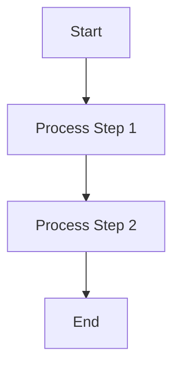

# Mermaid Whitespace Optimization Skill

When designing hardware architecture documentation, screen real estate is precious. Excessive vertical whitespace forces the user to scroll unnecessarily and breaks the "zero-drag" philosophy of a good hardware dashboard.

This skill guide outlines the best practices for minimizing whitespace in Mermaid diagrams.

## 📏 Core Strategy: Horizontal Over Vertical (`LR` vs `TD`)

The default rendering direction for most flowcharts is Top-Down (`TD`). While this works for simple trees, linear hardware pipelines and multi-stage decision loops quickly become extremely tall and narrow, leaving massive amounts of blank white space on the left and right sides of modern wide-screen monitors.

### ❌ The Problem: `graph TD`
Top-Down graphs stack nodes vertically.

*Result:* A tall, narrow block that wastes horizontal space.

### ✅ The Solution: `graph LR`
Whenever possible, force the rendering direction to Left-Right (`LR`). This takes advantage of the horizontal aspect ratio of modern displays.

*Result:* A compact, easy-to-scan horizontal flow that integrates beautifully into standard paragraph text without causing huge page breaks.

## 🛠️ Advanced Whitespace & Readability Constraints

When `LR` alone isn't enough, or when it causes new problems (like shrinking the diagram to fit the page), apply the following strict constraints to maintain perfect readability and zero wasted space:

1. **Multi-Row Horizontal Layouts:** If a single `LR` chain is too long, Mermaid will automatically shrink the entire diagram to fit the screen width, resulting in unreadably tiny fonts. **Rule:** If a horizontal flowchart becomes too small, you must break it into multiple rows by using a `graph TD` root and embedding `direction LR` inside horizontal `subgraph`s.
2. **Strict Font Size Constraint:** The text inside any flowchart must remain legible. **Rule:** The minimum font size of your flowchart nodes must be strictly greater than or equal to the standard font size of a typical Sequence Diagram (which naturally wraps and scales well). Never allow a graph to compress so much that it becomes harder to read than a standard sequence diagram.
3. **Mandatory Captions:** Every diagram must be explicitly labelled. **Rule:** You must place a descriptive caption immediately below the Mermaid block using `
图 X：...
`. This ensures the technical context is preserved even if the diagram is rendered in isolation.
4. **Subgraphs for Tight Grouping:** Use subgraphs to cluster related nodes tightly. Mermaid's layout engine handles subgraphs much more efficiently in `LR` mode than in `TD` mode.
5. **Concise Node Text:** Use short, punchy node labels. Let the surrounding text explain the heavy details.

By strictly adhering to these layout and readability rules, we maintain a crisp, dense, and professional "zero-drag" documentation UI.
