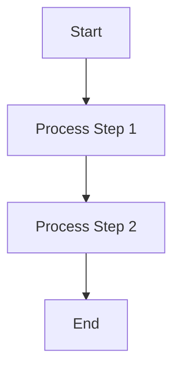
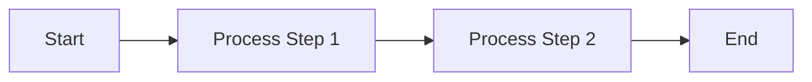

# Mermaid Whitespace Optimization Skill

When designing hardware architecture documentation, screen real estate is precious. Excessive vertical whitespace forces the user to scroll unnecessarily and breaks the "zero-drag" philosophy of a good hardware dashboard.

This skill guide outlines the best practices for minimizing whitespace in Mermaid diagrams.

## 📏 Core Strategy: Horizontal Over Vertical (`LR` vs `TD`)

The default rendering direction for most flowcharts is Top-Down (`TD`). While this works for simple trees, linear hardware pipelines and multi-stage decision loops quickly become extremely tall and narrow, leaving massive amounts of blank white space on the left and right sides of modern wide-screen monitors.

### ❌ The Problem: `graph TD`
Top-Down graphs stack nodes vertically.

*Result:* A tall, narrow block that wastes horizontal space.

### ✅ The Solution: `graph LR`
Whenever possible, force the rendering direction to Left-Right (`LR`). This takes advantage of the horizontal aspect ratio of modern displays.

*Result:* A compact, easy-to-scan horizontal flow that integrates beautifully into standard paragraph text without causing huge page breaks.

## 🛠️ Advanced Whitespace Constraints

When `LR` isn't enough, apply the following constraints to squeeze out every last pixel of wasted space:

1. **Subgraphs for Tight Grouping:** Use subgraphs to cluster related nodes tightly. Mermaid's layout engine handles subgraphs much more efficiently in `LR` mode than in `TD` mode.
2. **Concise Node Text:** Use short, punchy node labels. Avoid writing paragraphs inside the shapes. Let the surrounding HTML/Markdown text explain the heavy details.
3. **Link Adjustments:** If directional arrows (`-->`) force an awkward layout, you can sometimes use implicit links (`---`) or adjust link lengths to trick the layout engine into a tighter bounding box.

By strictly adhering to the `LR` layout rule for all linear or sequential hardware logic, we maintain a crisp, dense, and professional "zero-drag" documentation UI.
